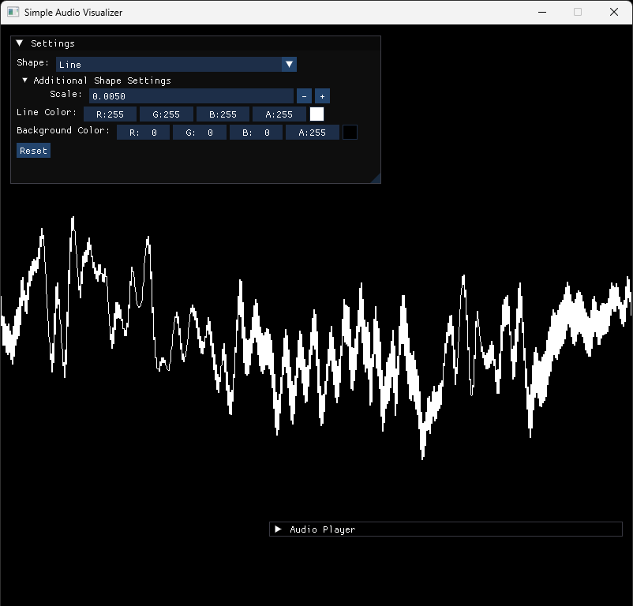
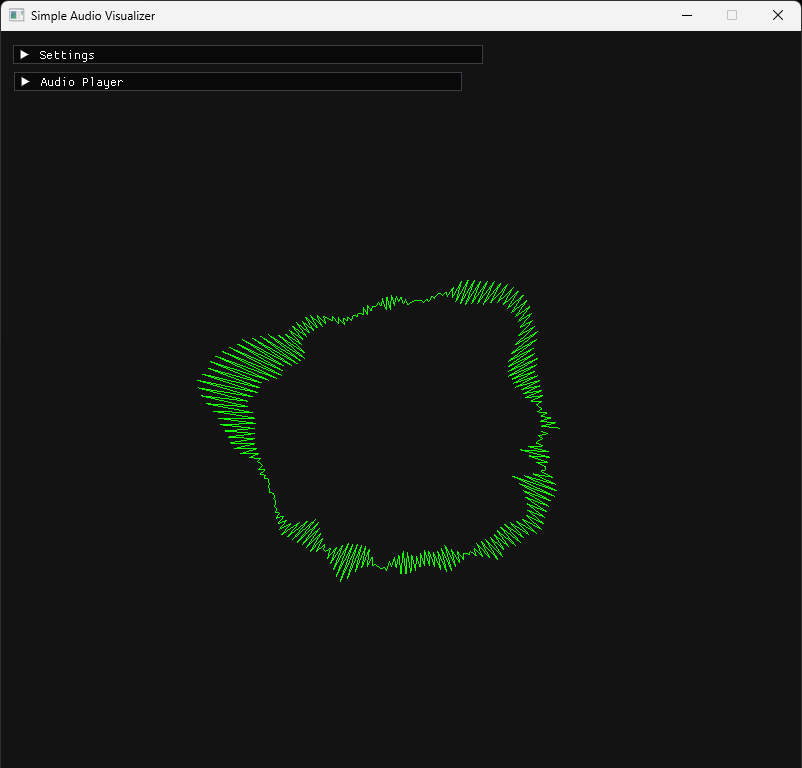

# Simple Audio Visualizer
This project displays visuals that are responsive to music. Each visual has elements that can be manipulated through provided settings to create unique graphics.

## Screenshots

    
    

## General Info
This project includes two _ImGui_ windows (Audio Player, Settings). Each window supports dragging and collapsing. You can collapse a window by pressing the dropdown arrow at the top left.

### Audio Player Window
* In the 'File Path' textbox, provide a valid file path to a SFML supported audio file (.wav is recommended).
* If your file path is valid and your file is supported, when pressing the 'Import' button, the 'Current File' text will update to your provided file path.
* The music file will play on a loop, you can press the 'Play/Pause' button to play/pause audio and visuals.

### Settings Window
* You can change visuals by choosing an option in the 'Shape' combobox.
* Additional shape settings are included in a dropdown below the 'Shape' combobox, where you can manipulate elements of each visual.
* Colors for the visual and background can be changed in their relative colorbox.
* If you need to reset the settings back to default, you can press the 'Reset' button.

## External Libraries
* SFML (Simple and Fast Multimedia Library)
* ImGui (Immediate Mode Graphical User Interface)
